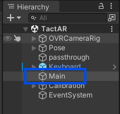

# Guidance for Building from Source
1. Clone the Project.
   
   ```
   git clone https://github.com/xiaoxiaoxh/TactAR_APP
   ```

2. Install Unity Hub and install Unity Editor **2022.3.x LTS** through Unity Hub.
   
   [Install the Unity Hub](https://unity.com/download)
   
   You can install it according to the official documentation: 
   
   [Downloading and installing Editors and modules with the Unity Hub | Unity Hub | 3.0](https://docs.unity3d.com/hub/manual/InstallEditors.html)

   When installing unity editor, you need to include android build-related components.

   

3. `Add` and `Open Project` in Unity Editor.

    

4. Find and double-click `Scene/Teleoperation` in the `Project` window.

    

5. (Optional) Find and Click the `Main` object in the `Hierarchy` window and make changes to the panels of the following components as needed.

    

    

    `VRController`: The component for collecting the poses and commands of the VR controller and sending to the worksation via HTTP.

    Important parameters：

    * `IP`: The default IP of the workstation. This can also be manually modified in the AR surface via the AR keyboard. 
    * `Port`: The default port of the workstation.
    * `Hz`: The frequency at which the VR controller pose data is sent to the workstation.

    `VisualizationServer`: The component for receiving visualization data from the workstation via UDP and rendering them in AR. The data includes:
    - `Robot`: TCP pose of the robot.
    - `Arrow`: 3D deformation field of tactile sensors.
    - `Force`: 3D deformation field of force sensors.
    - `Image`: Image streams of RGB/tactile cameras.

6. (Optional) If you want to modify the name of the final built application, please find the menu `Edit/Project Setting` - `Player` - `ProductName`

    

7. Build your modified version to Quest 3.

    **Due to Meta's installation restrictions on unknown source APKs, you need to turn on developer mode and enable USB debugging to build into Quest!**

    https://developers.meta.com/horizon/documentation/native/android/mobile-device-setup/
    
    Connect the Quest3 headset to the computer via USB, Click on the Unity Editor menu `File/Build Setting`.

    Follow the image below to set up and select your Quest3 device in `Run Device`.

    Click `Build and Run`.

    
