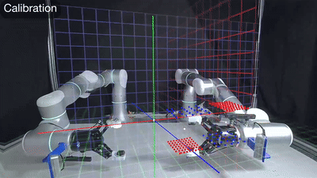
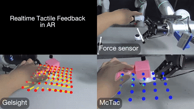
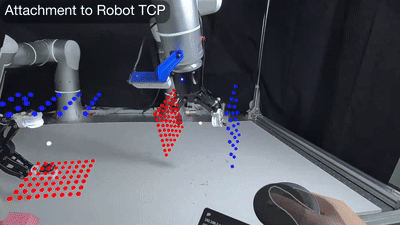
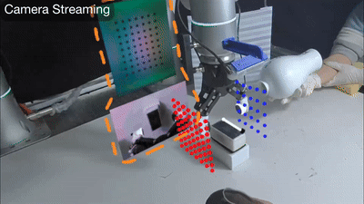

# TactAR APP

This is the source code for the tactile/force teleoperation APP called **TactAR** in the RSS 2025 paper "[Reactive Diffusion Policy: Slow-Fast Visual-Tactile Policy Learning for Contact-Rich Manipulation](https://reactive-diffusion-policy.github.io/)".

# Overview

Overview of TactAR teleoperation system. It can provide real-time tactile / force feedback via Augmented Reality (AR). The tactile feedback is represented as the 3D deformation field, which is a universal representation applicable to multiple different tactile / force sensors. The 3D deformation field is rendered and "attached" to the robot end-effector in AR, which makes the user perceive the rich contact information in 3D space. TactAR also support real-time streaming for multiple RGB cameras and optical tactile sensors.

# Features
## Calibration

The user adjust the translation and rotation of the virtual coordinate system such that it can align with the pre-defined TCP position (the white sphere) and the origin of the world coordinate system.

## Realtime Tactile Feedback in AR

The 3D deformation / force field of the tactile / force sensors can be rendered in real time with Augmented Reality (AR).

## Attachment to Robot RCP

The 3D deformation field is attached to the robot end-effector in virtual space.

## Camera Streaming

The system supports real-time streaming of multi-view RGB cameras and tactile cameras for more immersive teleoperation experience.

# Example Tasks

When collecting contact-rich task data through teleoperation, the system can provide intuitive tactile / force information.

# Requirements
## Hardware
- [Meta Quest3 128GB](https://www.meta.com/quest/quest-3/) VR headset.
- Please see the [RDP repository](https://github.com/xiaoxiaoxh/reactive_diffusion_policy) for other hardware and software requirements for the whole teleoperation system.

## Network
-  Make sure that the Quest 3, the workstation and the robots are in the same local area network (LAN).  
- (Optional) For Chinese users, please use custom proxy to activate Quest 3. We recommend configuring a proxy plugin directly within the Wi-Fi-enabled router, specifically to route traffic for the Quest 3 through the proxy. After activating Quest 3, you can disable the proxy and only use the local network for teleoperation.

# Installation
## [Option 1] Install the pre-built APK 
If there is no need to modify the code or if you simply want to test the functionality of the APP, you can directly use our released version.

1. Download the APK from the Github [release pages](https://github.com/xiaoxiaoxh/TactAR_APP/releases).

2. Please refer to the following official documentation to download Meta Quest Developer Hub and install the APK into Meta Quest3.

    - https://developers.meta.com/horizon/documentation/unity/ts-odh-getting-started

    - https://developers.meta.com/horizon/documentation/unity/ts-odh-deploy-build

## [Option 2] Build from source
If you want to modify the code or the default paramaters (e.g. workstation IP and port), you need to build the Unity APK from source following the [building guidance](Docs/Build.md) and install it into Quest 3.

# User Guide
Please refer to the [user guide](Docs/User_Guide.md) for detailed guidance on how to use TactAR for teleoperation.

